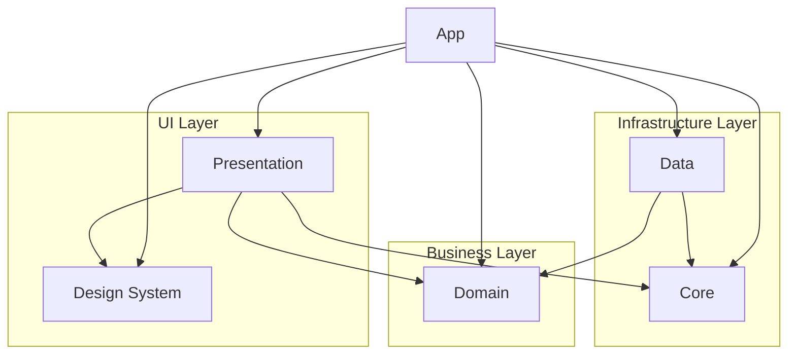

# **Architecture**

## **Purpose**

This document defines the architectural foundation of every Android project built with this playbook.

Architecture is not optional.

Every feature, module, and implementation should follow these principles unless an Architecture Decision Record (ADR) explicitly documents an exception.

---

# **Goals**

This architecture prioritizes:

- Readability
- Maintainability
- Testability
- Scalability
- Reusability
- Separation of concerns
- Low coupling
- High cohesion

The objective is to build software that remains easy to evolve over time.

---

# **Architecture Principles**

The architecture is based on four fundamental ideas:

- Modularization
- Separation of responsibilities
- Unidirectional data flow
- Explicit dependencies

Module names may change between projects.

Module responsibilities must not.

---

# **Recommended Modules**

|**Module**|**Responsibility**|
|---|---|
|app|Composition root, DI, navigation, startup|
|presentation|UI, ViewModels, MVI|
|domain|Business logic|
|data|Data access|
|design-system|Reusable UI|
|core|Shared infrastructure|

---

# **High-Level Architecture**



---

# **Layer Responsibilities**

## **UI Layer**

Responsible for rendering information.

Contains:

- Compose
- ViewModels
- MVI
- Navigation
- Screen state

Never contains business rules.

---

## **Business Layer**

Responsible for business decisions.

Contains:

- UseCases
- Entities
- Repository interfaces
- Validation

Independent from Android whenever possible.

---

## **Infrastructure Layer**

Responsible for external systems.

Contains:

- Retrofit
- Room
- Repository implementations
- Mappers
- Data sources

Never exposes infrastructure models outside the layer.

---

# **Dependency Rules**

Dependencies always point inward.

```text
App
 ↓
Presentation
 ↓
Domain
 ↑
Data

Presentation
 ↓
Design System

Presentation
 ↓
Core

Data
 ↓
Core
```

Circular dependencies are never allowed.

---

# **Logical Flow**

Events move downward.

```text
UI
↓
Presentation
↓
Domain
↓
Data
```

Data moves upward.

```text
Data
↑
Domain
↑
Presentation
↑
UI
```

---

# **Source of Truth**

When local persistence exists:

```text
Remote API
        ↓
Repository
        ↓
Local Database
        ↓
Domain Model
        ↓
UiState
```

The UI should observe local data.

The repository is responsible for synchronizing remote changes.

---

# **Module Independence**

Every module owns exactly one responsibility.

A module should not know implementation details of another module.

Communication should happen through stable contracts.

---

# **Architecture Decision Rule**

When deciding where new code belongs:

|**Question**|**Module**|
|---|---|
|Is it app startup?|app|
|Is it screen behavior?|presentation|
|Is it business logic?|domain|
|Is it networking or persistence?|data|
|Is it reusable UI?|design-system|
|Is it generic infrastructure?|core|

---

# **Architecture Constraints**

Always:

- Respect module boundaries.
- Prefer composition over duplication.
- Keep dependencies explicit.
- Make state immutable.
- Follow existing project conventions.

Never:

- Put business logic inside UI.
- Expose DTOs outside the data layer.
- Make Domain depend on Android UI.
- Create circular dependencies.
- Hardcode design values.
- Skip architecture for convenience.

---

# **Scalability**

The architecture should allow:

- New features without modifying existing ones.
- Independent module evolution.
- Easy testing.
- Component reuse.
- Incremental refactoring.

Large projects should grow by adding feature modules rather than increasing complexity inside existing modules.

---

# **Final Principle**

Architecture exists to reduce complexity.

Every architectural decision should make the project easier to understand, easier to test, and easier to maintain.