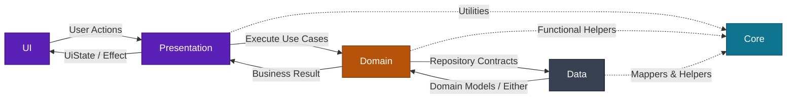
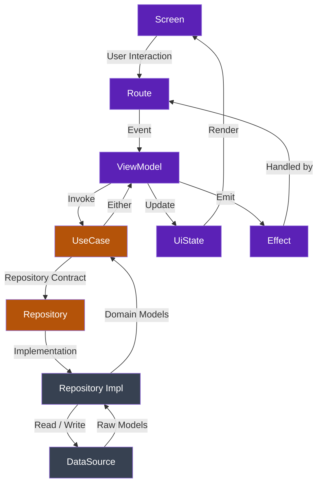
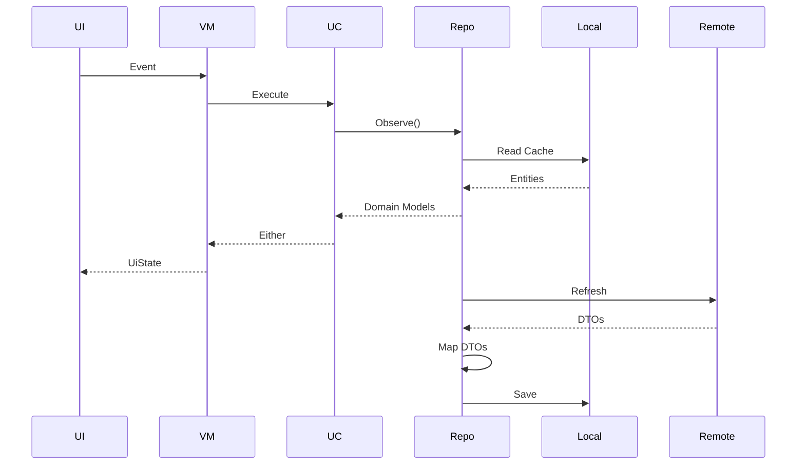

# Data Flow

## Purpose

This document defines how data moves through the application.

A predictable data flow makes the codebase easier to understand, test, maintain, and scale.

The architecture follows a **unidirectional data flow** where user interactions travel downward through the architecture, while state and business results travel back upward to the UI.

---

## Core Principles

- Events always flow downward.
- Data always flows upward.
- Business decisions belong to the Domain layer.
- Infrastructure details remain inside the Data layer.
- Presentation only renders state.
- ViewModels orchestrate the flow but never contain infrastructure code.

---

## High-Level Architecture Flow



---

## Runtime Request Flow

Every feature should follow the same execution path.

```text
Screen
→ Route
→ ViewModel
→ UseCase
→ Repository Interface
→ Repository Implementation
→ DataSource
```

Business results return through the same layers in reverse order.

```text
DataSource
→ Repository Implementation
→ Domain Model
→ UseCase
→ ViewModel
→ UiState
→ Screen
```

---

## Runtime Sequence



---

## Repository Pattern

Repositories expose only **domain models**.

The Data layer owns every infrastructure concern.

```text
Presentation
      │
      ▼
UseCase
      │
      ▼
Repository Interface
      │
      ▼
Repository Implementation
      │
 ┌────┴────┐
 ▼         ▼
Remote   Local
```

Repositories are responsible for:

- Choosing the appropriate data source.
- Mapping infrastructure models into domain models.
- Hiding implementation details.
- Returning `Either<Failure, Result>`.

---

## Offline-First Flow

When local persistence exists, the local database becomes the source of truth.

The repository refreshes local data from the network instead of returning remote DTOs directly.



---

## Result Flow

All business operations should return a predictable result.

```text
Either<Failure, Success>
```

```text
Success
 └── Domain Model

Failure
 ├── Network
 ├── Validation
 ├── Unauthorized
 ├── Server
 └── Unknown
```

The Presentation layer should never receive DTOs or database entities.

---

## Functional Core

The `core` module provides reusable abstractions used across the project.

Typical examples include:

- Either
- ResultMapper
- Coroutine helpers
- Extensions
- Dispatcher providers
- Functional utilities

The goal is to keep common logic reusable without introducing feature dependencies.

---

## Data Flow Rules

✅ Presentation communicates with Domain only.

✅ Domain communicates with Repository interfaces only.

✅ Data implements Repository interfaces.

✅ Infrastructure models remain inside Data.

✅ Domain models travel upward.

✅ State is immutable.

✅ UI reacts only to UiState and Effects.

---

## Never Do

❌ Call Retrofit from a ViewModel.

❌ Return DTOs from repositories.

❌ Expose Room entities outside Data.

❌ Put business logic inside Composables.

❌ Skip the Domain layer.

❌ Share mutable state across layers.

❌ Make UI responsible for deciding business rules.