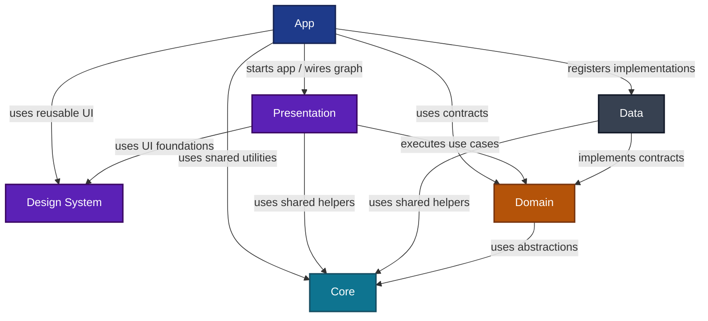
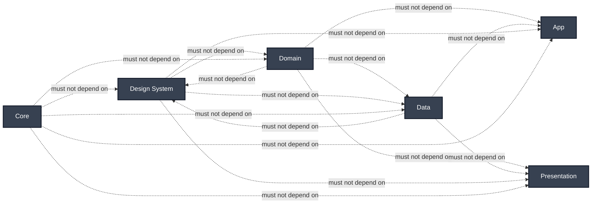

# Dependency Rules

## Purpose

This document defines which modules are allowed to depend on each other.

Dependency rules protect the architecture from accidental coupling, circular dependencies, and layer violations.

---

## Main Rule

Dependencies must point toward stable abstractions.

A module can depend on another module only when it needs its public contracts, models, utilities, or reusable UI foundations.

A module must never depend on implementation details from a higher or unrelated layer.

---

## Allowed Dependencies



---

## Dependency Matrix

| From | Can depend on | Why |
|---|---|---|
| `app` | `presentation`, `data`, `domain`, `design-system`, `core` | App wires everything together |
| `presentation` | `domain`, `design-system`, `core` | UI executes business logic and uses reusable UI |
| `domain` | `core` | Domain may use generic abstractions |
| `data` | `domain`, `core` | Data implements domain contracts and uses shared helpers |
| `design-system` | `core` only when needed | Reusable UI may use generic helpers |
| `core` | Nothing project-specific | Core must stay generic |

---

## Forbidden Dependencies



---

## Layer Rules

### App

Allowed dependencies:

- `presentation`
- `data`
- `domain`
- `design-system`
- `core`

Rules:

- `app` is the composition root.
- `app` may know all modules because it wires the application.
- `app` should not contain business logic.
- `app` should not contain reusable UI components.
- `app` should not contain data mapping logic.

---

### Presentation

Allowed dependencies:

- `domain`
- `design-system`
- `core`

Rules:

- `presentation` owns screens, routes, ViewModels, UI state, events, and effects.
- `presentation` calls use cases from `domain`.
- `presentation` uses reusable components from `design-system`.
- `presentation` may use generic helpers from `core`.

Forbidden:

- Direct dependency on repository implementations.
- Direct dependency on Retrofit APIs.
- Direct dependency on DAOs.
- Direct dependency on DTOs.
- Direct dependency on database entities.

---

### Domain

Allowed dependencies:

- `core`

Rules:

- `domain` owns business rules.
- `domain` owns use cases.
- `domain` owns entities.
- `domain` owns repository interfaces.
- `domain` may use generic functional abstractions from `core`, such as `Either`.

Forbidden:

- Android UI dependencies.
- Compose dependencies.
- Retrofit dependencies.
- Room dependencies.
- DTOs.
- Database entities.
- ViewModels.
- Navigation.

---

### Data

Allowed dependencies:

- `domain`
- `core`

Rules:

- `data` implements repository interfaces defined by `domain`.
- `data` owns DTOs, entities, data sources, API services, and mappers.
- `data` maps DTOs and database entities into domain models.
- `data` may use generic helpers from `core`, such as `Either`, `ResultMapper`, and mapping utilities.

Forbidden:

- Dependency on `presentation`.
- Dependency on UI models.
- Dependency on `design-system`.
- Dependency on navigation.
- Returning DTOs or database entities outside the data layer.

---

### Design System

Allowed dependencies:

- `core` only when necessary.

Rules:

- `design-system` owns reusable UI foundations.
- `design-system` must stay feature-agnostic.
- `design-system` may expose tokens, themes, and reusable components.

Forbidden:

- Dependency on feature modules.
- Dependency on `presentation`.
- Dependency on `domain`.
- Dependency on `data`.
- Dependency on ViewModels.
- Dependency on repositories.
- Feature-specific business logic.

---

### Core

Allowed dependencies:

- None project-specific.

Rules:

- `core` owns generic reusable abstractions.
- `core` must remain lightweight and stable.
- `core` may contain functional helpers, error models, result wrappers, coroutine helpers, extensions, and mapper contracts.

Forbidden:

- Android-specific dependencies in generic core.
- Feature-specific business logic.
- Presentation-specific logic.
- Data implementation details.
- Compose UI.
- ViewModel or Lifecycle dependencies.

If a helper depends on AndroidX, `ViewModel`, `viewModelScope`, `Context`, `Resources`, or Compose, it should live in an Android-specific module such as `presentation-core`, `core-android`, or the closest owning layer.

---

## Core Dependency Rule

Generic `core` should be framework-light.

Good candidates for `core`:

- `Either`
- `fold`
- `ResultMapper`
- Nullable extensions
- Collection extensions
- Coroutine helpers without Android dependencies
- Generic failure abstractions
- Dispatcher abstractions

Not good candidates for generic `core`:

- `ViewModel` extensions
- `viewModelScope` helpers
- `Context` helpers
- Compose utilities
- Android resources
- Navigation helpers
- Feature-specific validators

---

## Dependency Direction Examples

Good:

```text
presentation → domain
data → domain
data → core
domain → core
presentation → design-system
```

Bad:

```text
domain → data
domain → presentation
data → presentation
design-system → presentation
core → feature
presentation → data implementation
```

---

## Model Dependency Rules

Each layer owns its own models.

```text
Data layer
DTO / Entity

Domain layer
Domain Model

Presentation layer
UiState / UiModel
```

Allowed mapping direction:

```text
DTO / Entity → Domain Model → UiState / UiModel
```

Forbidden:

```text
DTO → UiState
Entity → UiState
UiModel → Entity
Domain → DTO
```

---

## Agent Rules

Before adding or changing a dependency, the agent must:

1. Inspect `settings.gradle.kts`.
2. Identify the existing modules.
3. Check the current module dependency graph.
4. Verify that the dependency direction is allowed.
5. Prefer existing abstractions before adding new dependencies.
6. Avoid adding libraries unless explicitly needed.
7. Explain why a new dependency is required.

The agent must not:

- Add circular dependencies.
- Add implementation dependencies across layers.
- Make `domain` depend on framework code.
- Make `design-system` depend on features.
- Make `core` a dumping ground.
- Add Android-specific helpers to generic `core`.

---

## Final Rule

A dependency is allowed only when it makes the architecture clearer.

If a dependency makes the code easier today but harder to maintain tomorrow, it should not be added.